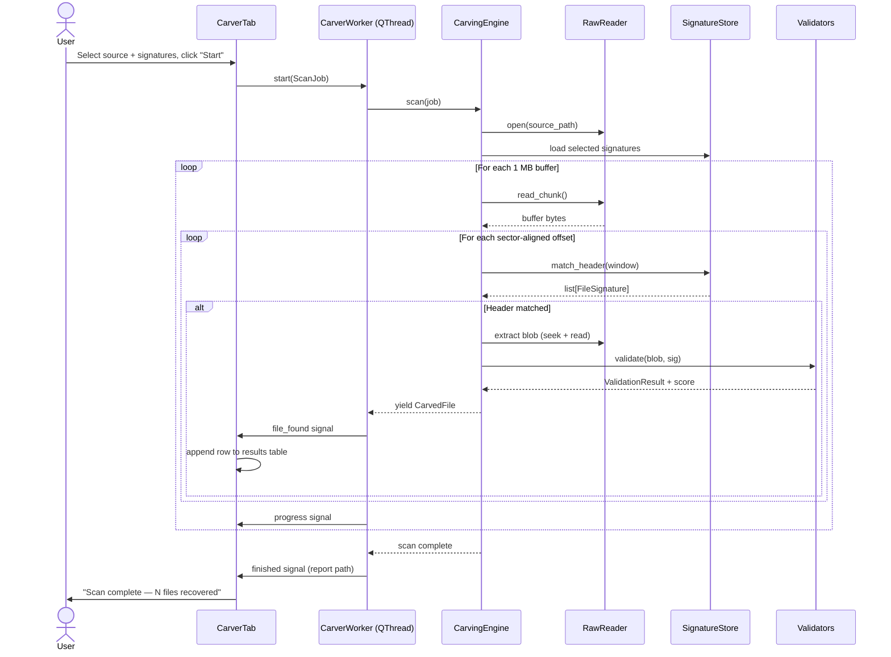

# BitScan — File Carving & Recovery Module: Implementation Architecture

## 1. Problem Recap

We need to recover deleted files from formatted, damaged, or corrupted media **without relying on file-system metadata**. The carver must:

- Scan raw block devices or disk images byte-by-byte.
- Identify files via **magic-byte signatures** (header + optional footer).
- Handle **fragmented** files (non-contiguous clusters).
- Assign a **confidence score** to every recovered artifact.
- Classify recovered files automatically (images, documents, archives, etc.).
- Produce **forensic-grade reports** with chain-of-custody metadata.
- Integrate into the existing PyQt6 UI as the "File Carver" tab.

---

## 2. High-Level Architecture

```
┌──────────────────────────────────────────────────────────────┐
│                       PyQt6 UI Layer                         │
│  (CarverTab ↔ CarverWorker via QThread + signals/slots)      │
└────────────────────────┬─────────────────────────────────────┘
                         │  progress / results
                         ▼
┌──────────────────────────────────────────────────────────────┐
│                   Carving Engine (orchestrator)               │
│  Receives a ScanJob, drives the pipeline, emits CarvedFile   │
│  objects.                                                     │
└──┬──────────┬──────────┬──────────────┬──────────────────────┘
   │          │          │              │
   ▼          ▼          ▼              ▼
┌───────┐ ┌────────┐ ┌──────────┐ ┌───────────────┐
│ RawIO │ │SigStore│ │Validators│ │ ReportWriter  │
│ Layer │ │(sigs)  │ │& Scoring │ │ (forensic log)│
└───────┘ └────────┘ └──────────┘ └───────────────┘
```

### Layer Responsibilities

| Layer | Responsibility |
|---|---|
| **RawIO** | Open block devices / image files, read in configurable chunk sizes, expose a uniform streaming interface. |
| **SignatureStore** | Load/manage file-type signatures (header magic, optional footer magic, max file size). Ships with a built-in DB; user can extend via JSON/YAML. |
| **CarvingEngine** | Slide a window over the raw stream, match headers, find footers (or fall back to max-size), extract candidate blobs. |
| **Validators & Scoring** | Run lightweight structural checks on each carved blob (e.g. JPEG SOI→EOI, PNG IHDR CRC, PDF xref) and assign a 0–100 confidence score. |
| **ReportWriter** | Persist recovered files, generate a forensic summary (JSON + optional HTML/PDF). |
| **UI (CarverTab)** | Select source, pick target signatures, launch scan, show live progress, display results table, export report. |

---

## 3. Module & Package Layout

```
src/
├── carver/
│   ├── __init__.py
│   ├── engine.py          # CarvingEngine – main orchestrator
│   ├── raw_io.py          # RawReader – buffered raw device/image reader
│   ├── signatures.py      # SignatureStore + FileSignature dataclass
│   ├── validators.py      # per-type structural validators
│   ├── scoring.py         # confidence scoring logic
│   ├── fragment.py        # fragmented-file reassembly heuristics
│   ├── classifier.py      # auto-classify recovered blobs by category
│   ├── report.py          # forensic report generation
│   └── sigs/
│       └── default.json   # built-in signature database
├── ui/
│   ├── main_window.py     # (existing) – adds CarverTab
│   └── carver_tab.py      # (new) – extracted & wired-up carver UI
└── models/
    ├── __init__.py
    └── carved_file.py     # CarvedFile dataclass (result model)
```

---

## 4. Core Data Models

```python
# models/carved_file.py

from dataclasses import dataclass, field
from enum import Enum
from pathlib import Path
import hashlib, datetime

class FileCategory(Enum):
    IMAGE    = "image"
    DOCUMENT = "document"
    ARCHIVE  = "archive"
    VIDEO    = "video"
    AUDIO    = "audio"
    UNKNOWN  = "unknown"

@dataclass
class CarvedFile:
    """Represents a single recovered artifact."""
    id:             int                        # sequential carve ID
    source_offset:  int                        # byte offset on source media
    size:           int                        # recovered blob size in bytes
    file_type:      str                        # e.g. "jpeg", "png", "pdf"
    extension:      str                        # e.g. ".jpg"
    category:       FileCategory               # auto-classified bucket
    confidence:     float                      # 0.0 – 100.0
    md5:            str  = ""                  # integrity hash
    sha256:         str  = ""                  # integrity hash
    output_path:    Path | None = None         # where the blob was saved
    timestamp:      datetime.datetime = field(
                        default_factory=datetime.datetime.now)
    fragments:      list[tuple[int,int]] = field(default_factory=list)
                        # list of (offset, length) if reassembled from fragments
```

```python
# carver/signatures.py

from dataclasses import dataclass

@dataclass
class FileSignature:
    name:           str          # human label, e.g. "JPEG Image"
    extension:      str          # ".jpg"
    header:         bytes        # magic bytes, e.g. b'\xff\xd8\xff'
    footer:         bytes | None # optional end marker, e.g. b'\xff\xd9'
    max_size:       int          # maximum carved length in bytes (safety cap)
    category:       str          # "image", "document", etc.
    header_offset:  int = 0      # some formats have the magic a few bytes in
```

---

## 5. Component-by-Component Design

### 5.1 RawReader (`raw_io.py`)

**Purpose:** Abstract away the difference between a raw `/dev/sdX` block device and a `.img` / `.dd` disk image file. Provide a buffered, seekable stream.

```
class RawReader:
    def __init__(self, path: str, chunk_size: int = 4096):
        ...
    def read_chunk(self) -> bytes | None:
        """Return next chunk or None at EOF."""
    def seek(self, offset: int): ...
    def read_at(self, offset: int, length: int) -> bytes: ...
    def total_size(self) -> int: ...
    def close(self): ...
```

**Key decisions:**
- Default `chunk_size = 4096` (matches common sector/cluster size).
- Uses Python's built-in `open(path, 'rb')` — works for both files and block devices on Linux.
- Reads are sequential during scanning; random access is used during extraction.
- For block devices, `total_size` is obtained via `ioctl(BLKGETSIZE64)` or `os.lseek(fd, 0, os.SEEK_END)`.

### 5.2 SignatureStore (`signatures.py`)

**Purpose:** Load, index, and query file-type signatures.

```
class SignatureStore:
    def __init__(self):
        self.signatures: list[FileSignature] = []
        self._header_index: dict[bytes, list[FileSignature]] = {}

    def load_builtin(self): ...
    def load_from_json(self, path: str): ...
    def add(self, sig: FileSignature): ...
    def match_header(self, buf: bytes) -> list[FileSignature]:
        """Return all signatures whose header appears at position 0 of buf."""
```

**Built-in `default.json` will ship with signatures for at minimum:**

| Type | Header (hex) | Footer (hex) | Max Size |
|---|---|---|---|
| JPEG | `FF D8 FF` | `FF D9` | 25 MB |
| PNG | `89 50 4E 47 0D 0A 1A 0A` | `49 45 4E 44 AE 42 60 82` | 25 MB |
| PDF | `25 50 44 46` (`%PDF`) | `25 25 45 4F 46` (`%%EOF`) | 100 MB |
| ZIP | `50 4B 03 04` | `50 4B 05 06` | 500 MB |
| GIF | `47 49 46 38` | `00 3B` | 25 MB |
| BMP | `42 4D` | *(none)* | 50 MB |
| DOCX | `50 4B 03 04` | `50 4B 05 06` | 100 MB |
| MP4 | `00 00 00 .. 66 74 79 70` | *(none)* | 2 GB |
| MP3 | `FF FB` / `49 44 33` | *(none)* | 50 MB |

**Header matching strategy:**
- Build a prefix trie or dict keyed on the first N bytes (N = length of longest header) for O(1) lookup per chunk.
- When multiple signatures share a prefix (e.g. ZIP and DOCX both start with `PK`), all matching candidates are returned; the validator stage disambiguates.

### 5.3 CarvingEngine (`engine.py`)

This is the core scanning loop. The algorithm:

```
┌─────────────────────────────────────────────────────────┐
│  for each chunk in RawReader:                           │
│    slide a window of `max_header_len` bytes             │
│    at every sector-aligned offset within the chunk:     │
│      matches = SignatureStore.match_header(window)      │
│      for each match:                                    │
│        if sig.footer exists:                            │
│          scan forward for footer (up to sig.max_size)   │
│          extract [header_offset .. footer_offset+len]   │
│        else:                                            │
│          extract [header_offset .. header_offset+max]   │
│        validate & score the blob                        │
│        yield CarvedFile(...)                             │
└─────────────────────────────────────────────────────────┘
```

```python
class ScanJob:
    """Configuration for a single carving run."""
    source_path:    str               # device or image path
    output_dir:     str               # where to write carved files
    signatures:     list[str]         # which sig names to scan for (or ["all"])
    sector_size:    int = 512         # alignment granularity
    read_buffer:    int = 1024 * 1024 # 1 MB read buffer

class CarvingEngine:
    def __init__(self, sig_store: SignatureStore, validators: ValidatorRegistry):
        ...

    def scan(self, job: ScanJob) -> Generator[CarvedFile, None, None]:
        """
        Main entry point. Yields CarvedFile objects as they are
        discovered. The caller (UI worker) can consume these
        incrementally to update the results table in real time.
        """

    def _scan_buffer(self, buf: bytes, base_offset: int) -> list[_RawHit]:
        """Find all header matches within a buffer."""

    def _extract_blob(self, reader: RawReader, hit: _RawHit, sig: FileSignature) -> bytes:
        """Read from hit offset, search for footer or cap at max_size."""
```

**Performance considerations (Python-specific):**
- The inner scanning loop is CPU-bound. We use **`mmap`** when the source is a file/image for zero-copy reads.
- For very large media, we **process in 1 MB buffers** rather than loading everything into memory.
- Header matching operates on `memoryview` slices to avoid copying.
- The `scan()` method is a **generator** — this lets the UI consume results lazily and update the progress bar without blocking.
- Sector-aligned scanning (`offset % sector_size == 0`) massively reduces the search space vs byte-by-byte.

### 5.4 Fragmented File Reassembly (`fragment.py`)

This is the hardest part and where we provide "best effort" rather than perfection.

**Strategy — Bifragment Gap Carving (BGC):**

1. When a carved blob fails validation (e.g. JPEG has correct header but truncated/corrupt body), mark it as a **fragment candidate**.
2. Track all unmatched regions (gaps) between known carved files.
3. For each fragment candidate, try appending successive gap blocks and re-validating.
4. If validation passes, mark as reassembled and record the fragment map.

```python
class FragmentReassembler:
    def try_reassemble(
        self, head_blob: bytes, gap_map: list[tuple[int,int]],
        reader: RawReader, sig: FileSignature,
        validator: Validator
    ) -> tuple[bytes, list[tuple[int,int]]] | None:
        """
        Attempt to complete a truncated blob by appending gap regions.
        Returns (complete_blob, fragment_offsets) or None.
        """
```

> **Realistic scope for Python:** Full fragmented reassembly is computationally expensive. We will implement **simple bifragment gap carving** (one gap in the middle) as the initial pass, and mark multi-fragment cases as "partial recovery — low confidence" in the output.

### 5.5 Validators & Scoring (`validators.py`, `scoring.py`)

**Validators** are per-file-type structural checks:

```python
class Validator(Protocol):
    def validate(self, data: bytes, sig: FileSignature) -> ValidationResult: ...

@dataclass
class ValidationResult:
    is_valid:       bool
    structure_ok:   bool    # e.g. JPEG markers present, PNG CRCs match
    header_ok:      bool
    footer_ok:      bool
    details:        str     # human-readable explanation

class ValidatorRegistry:
    """Maps signature names to their Validator implementation."""
    def register(self, sig_name: str, validator: Validator): ...
    def get(self, sig_name: str) -> Validator | None: ...
```

**Built-in validators we'll implement:**

| Type | Checks |
|---|---|
| JPEG | SOI marker, APP0/APP1 segment, EOI marker, JFIF/EXIF header |
| PNG | IHDR present, CRC per chunk, IEND present |
| PDF | `%PDF-` version header, `%%EOF` footer, `xref` or `startxref` present |
| ZIP | Local file header, Central directory present |
| GIF | Header block, trailer byte `0x3B` |
| *Fallback* | Header/footer presence only |

**Confidence scoring formula:**

```
score = (
    30 * header_match         # 30 pts: correct magic bytes
  + 20 * footer_match         # 20 pts: correct footer found
  + 30 * structure_valid      # 30 pts: internal structure checks pass
  + 10 * size_reasonable      # 10 pts: size within expected range for type
  + 10 * not_fragmented       # 10 pts: single contiguous extraction
)
# Each factor is 0.0 or 1.0 (binary) → total is 0–100
# Fragmented reassembled files lose the last 10 points
```

### 5.6 Classifier (`classifier.py`)

Maps file types to high-level categories for the UI filter/grouping:

```python
CATEGORY_MAP = {
    "jpeg": FileCategory.IMAGE,
    "png":  FileCategory.IMAGE,
    "gif":  FileCategory.IMAGE,
    "bmp":  FileCategory.IMAGE,
    "pdf":  FileCategory.DOCUMENT,
    "docx": FileCategory.DOCUMENT,
    "zip":  FileCategory.ARCHIVE,
    "mp4":  FileCategory.VIDEO,
    "mp3":  FileCategory.AUDIO,
}

def classify(file_type: str) -> FileCategory:
    return CATEGORY_MAP.get(file_type, FileCategory.UNKNOWN)
```

This is intentionally simple. If we ever need smarter classification (e.g. distinguish DOCX from plain ZIP), the validator layer handles that disambiguation before the classifier runs.

### 5.7 ReportWriter (`report.py`)

Generates forensic-grade output:

```python
class ReportWriter:
    def __init__(self, output_dir: str, source_path: str): ...

    def add_entry(self, carved: CarvedFile): ...

    def finalize(self) -> Path:
        """
        Write the final report. Returns path to the report file.
        Outputs:
          - carved_files/           (the actual recovered blobs)
          - manifest.json           (machine-readable: list of CarvedFile dicts)
          - report.html             (human-readable forensic summary)
          - audit.log               (timestamped log of every action)
        """
```

**Report contents:**
- Source media path, size, hashes (MD5 + SHA-256 of the source).
- Scan parameters (signatures used, sector size, timestamp).
- Per-file entry: offset, size, type, confidence, MD5, SHA-256, fragment map.
- Summary statistics: total files recovered, breakdown by category, confidence distribution.

---

## 6. Threading Model (Python + PyQt6)

```
Main Thread (Qt event loop)
  │
  ├── CarverTab (UI widgets, signals/slots)
  │     │
  │     └── starts ──► QThread (CarverWorker)
  │                        │
  │                        ├── CarvingEngine.scan() generator
  │                        │     ├── reads from RawReader
  │                        │     ├── yields CarvedFile objects
  │                        │     └── emits progress_signal(percent)
  │                        │
  │                        └── emits result_signal(CarvedFile)
  │                              │
  │                              └──► CarverTab slot: append to results table
  │
  └── (Main thread stays responsive)
```

```python
# ui/carver_tab.py  (sketch)

class CarverWorker(QThread):
    progress = pyqtSignal(int)       # 0-100 percent
    file_found = pyqtSignal(object)  # CarvedFile
    finished = pyqtSignal(object)    # final report path
    error = pyqtSignal(str)

    def __init__(self, job: ScanJob): ...

    def run(self):
        engine = CarvingEngine(sig_store, validators)
        for carved in engine.scan(self.job):
            self.file_found.emit(carved)
        report_path = engine.report.finalize()
        self.finished.emit(report_path)
```

**Why QThread and not `multiprocessing`:**
- The bottleneck is disk I/O, not CPU — Python's GIL is not a problem here.
- QThread integrates natively with Qt's signal/slot mechanism for live UI updates.
- If we later need CPU parallelism (e.g. validating many blobs simultaneously), we can offload validation to a `concurrent.futures.ProcessPoolExecutor` inside the worker thread.

---

## 7. Scan Flow (End-to-End)



---

## 8. Python-Specific Technical Constraints & Mitigations

| Constraint | Mitigation |
|---|---|
| **GIL limits CPU parallelism** | Scanning is I/O-bound; GIL is not the bottleneck. Validation can be offloaded to `ProcessPoolExecutor` if needed. |
| **No raw disk access without privileges** | Document that the app must be run with `sudo` or the user must have read permissions on the target device. |
| **`mmap` size limits on 32-bit** | We target 64-bit Python only; `mmap` can map multi-TB files. For block devices, fall back to buffered `read()`. |
| **Speed vs. C/Rust carvers** | Sector-aligned scanning (skip 512 bytes at a time instead of 1 byte) keeps Python competitive for this use case. The real bottleneck is disk throughput. |
| **Memory pressure on large files** | Carved blobs are written to disk immediately, not held in memory. Only the header search window (a few KB) is in memory at any time. |

---

## 9. Dependencies

| Package | Purpose |
|---|---|
| `PyQt6` | GUI (already in use) |
| `python-magic` (optional) | Secondary MIME-type verification via libmagic |
| `hashlib` (stdlib) | MD5 / SHA-256 hashing of carved files |
| `mmap` (stdlib) | Zero-copy reads for disk images |
| `struct` (stdlib) | Parsing binary headers (PNG chunks, etc.) |
| `json` (stdlib) | Signature DB and manifest output |
| `jinja2` (optional) | HTML report templating |

---

## 10. Implementation Order

| Phase | Components | Notes |
|---|---|---|
| **Phase 1** | `FileSignature`, `SignatureStore`, `default.json` | Get the signature DB in place first. |
| **Phase 2** | `RawReader` | Buffered I/O for files + block devices. |
| **Phase 3** | `CarvingEngine` (basic: header scan, footer/max-size extraction) | Core scanning loop — generates carved blobs. |
| **Phase 4** | `Validators` (JPEG, PNG, PDF), `Scoring` | Quality checks + confidence scores. |
| **Phase 5** | `CarvedFile` model, `Classifier`, `ReportWriter` | Output pipeline. |
| **Phase 6** | `CarverWorker` (QThread), `CarverTab` wiring | Connect engine to UI with live progress. |
| **Phase 7** | `FragmentReassembler` (bifragment gap carving) | Advanced recovery — can be deferred. |
| **Phase 8** | Testing (create known-good test images with `dd`) | End-to-end validation. |

---

## 11. Test Strategy

- **Unit tests:** Each component in isolation — signature matching, validators, scoring formula.
- **Integration test image:** Use `dd` to create a small (~10 MB) raw image, write known files into it at known offsets, wipe the FAT/inode table, and verify the carver recovers them with correct hashes.
- **Regression corpus:** Maintain a set of test images with known ground truth (file count, types, offsets).
- **Performance benchmark:** Time the carver on a 1 GB image to establish a baseline; target < 60 seconds for contiguous-only carving.

